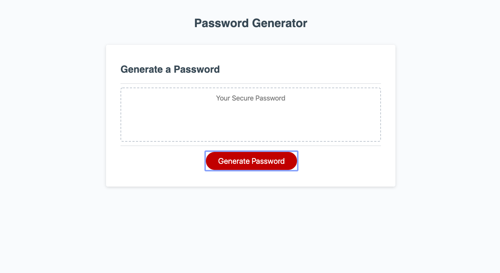
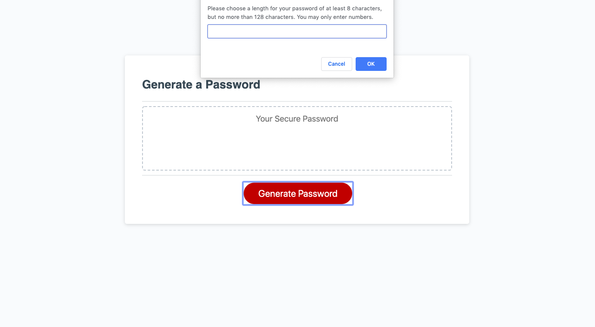
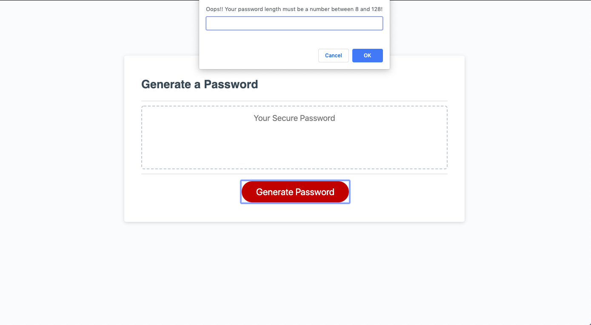
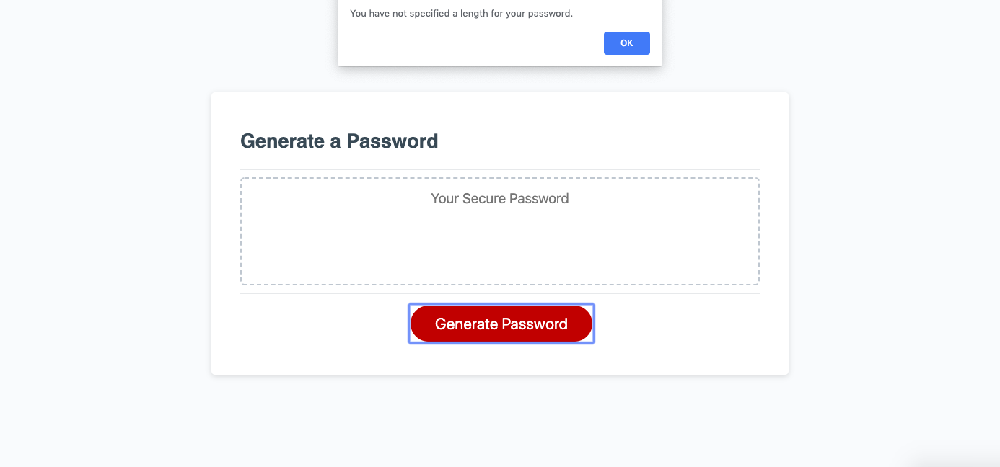
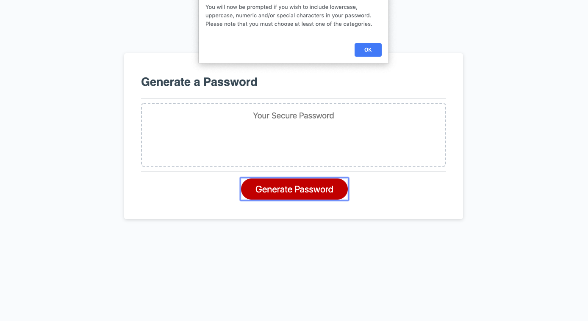
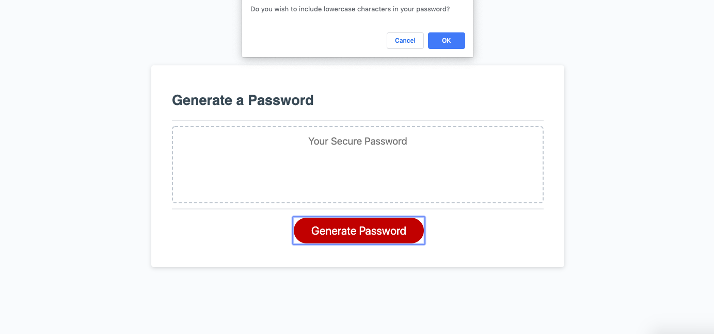
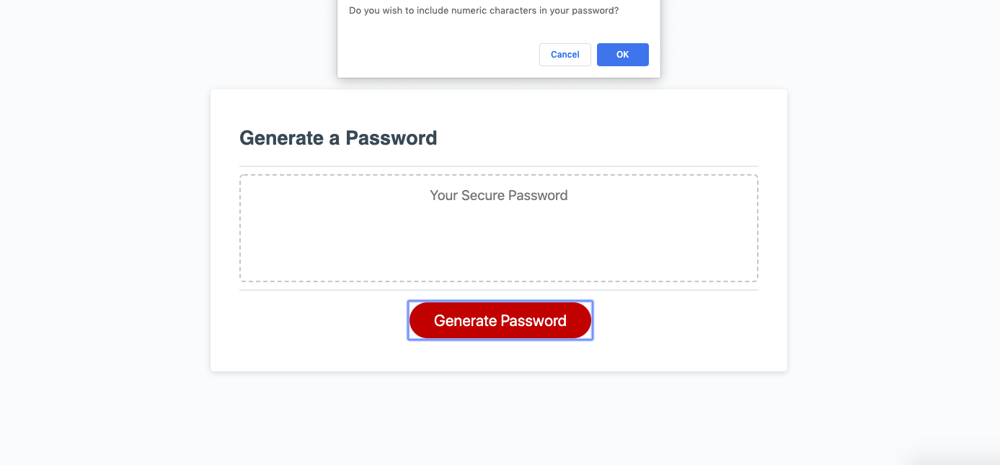
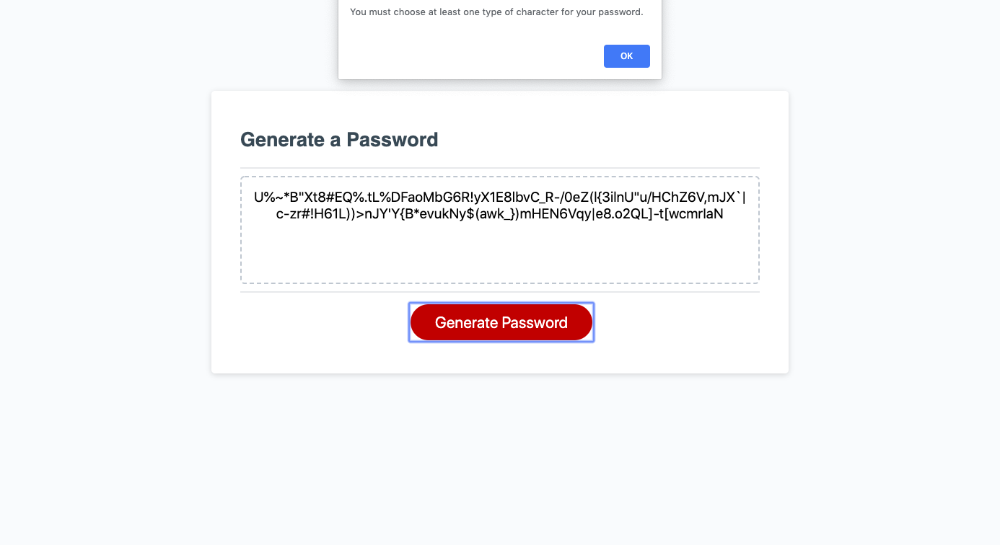
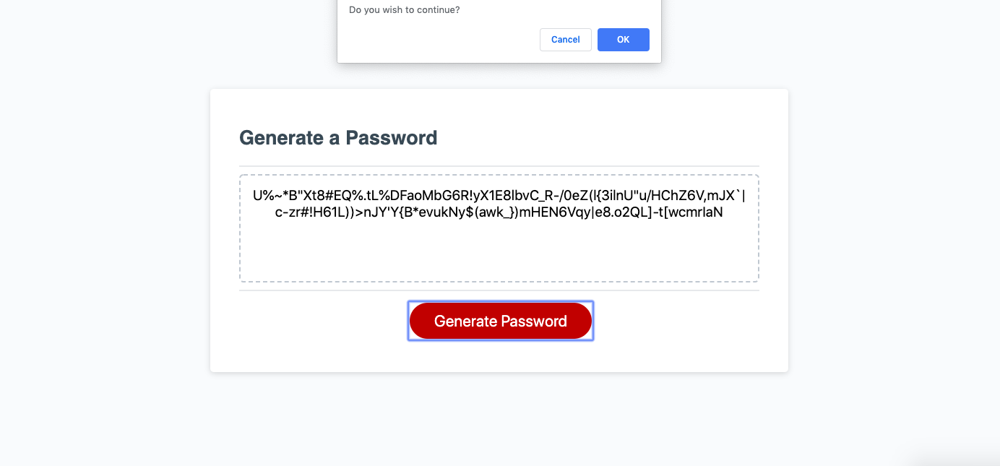
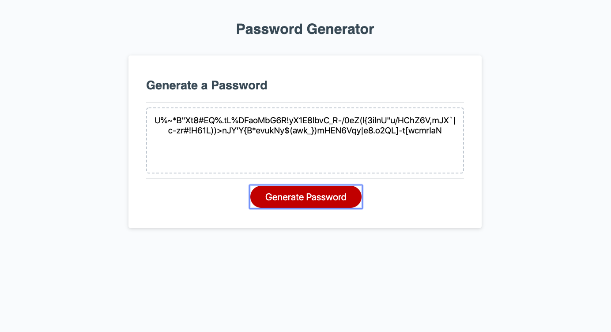

# password-generator

##Objective
The main goal for this project was to create a random password generator. The user is prompted to specify the length of the password in a given range.
They are also asked what type of characters they want to include in their password (lowercase, uppercase, numeric and/ or special).
With the given parameters a random password is generated and displayed when the generate button.

##Description of Code
The input for password length is first stored in a variable. The possible characters in their password is first initialized as an empty string. The characters they wish to include in their password are added to that empty string. A random number generator is used to choose an index in the concatenated string that will be added to their randomly generated password. A for loop is used to generate the randomly generated characters for the duration of their desired password length.

##Preventing Invalid User Iputs
- If the user doesn't enter a number within the range then the user will be prompted again for a valid input. - If the user presses cancel when prompted for a password length then an empty string is returned
- If the user doesn't choose any of the categories for their password they will be asked if the want to continue and then the same questions will be asked again

##Screenshots
1. Main Webpage
<<<<<<< HEAD

=======
>>>>>>> cf8258e3c341ad6ba99cad1ab9c0fa25608f9118

2. Password Length

3. Error Password Length

4. Null Password Length

5. Description of the next steps alert

6. Lower characters confirm

7. Upper characters confirm

8. Numeric characters confirm

9. Special characters confirm

10. User did not choose one type of character for password

11. Continue

12. Example of a randonly generated password

##Future Endevers

1. Recreate the user interface
2. Add additonal buttons to clear the generated password and generate another one
3. Add additonal prompts and or confirms for the user to choose more parameters for their password
4. Refactor the code and ensure optimal runtime
